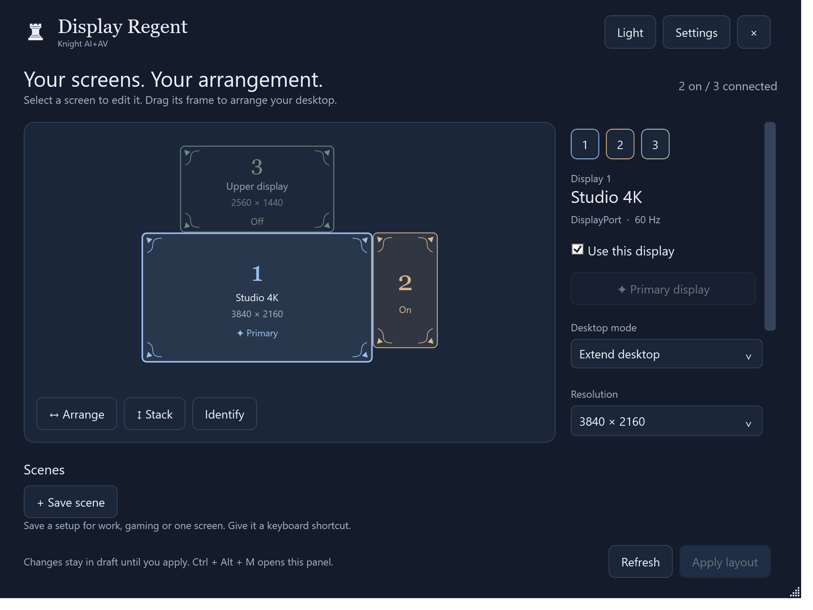

# Display Regent

A little reign over every screen, by **Knight AI+AV**. A free, local Windows tray app for display
selection, layout, primary display, mirroring, resolution and keyboard scenes.

[Website](https://www.knightaiav.com/display-regent/) ·
[Downloads](https://github.com/KNIGHT-AI-AV/display-regent/releases/tag/v0.1.0-preview) ·
[Quick start](docs/QUICKSTART.md)



## Preview status

Version 0.1.0 is an **unsigned preview**, not a trusted signed production release.
Source, automated layout checks, local hardware switching and installer acceptance
are separate from broader device coverage and signing. Windows may warn about the
publisher. SHA-256 checksums identify files but do not certify their publisher.

## Features

- Tray panel, always-on-top option, light and dark themes.
- Windows-reported monitor names, connections, resolutions and desktop positions.
- Resolution-scaled frames with fine ornamental corners and restrained hover motion.
- Enable/disable outputs; set primary; drag positions with edge snapping.
- Extend or mirror displays; mirrored targets retain independent on/off controls.
- Resolution choices from the active source's Windows-reported modes.
- Saved scenes, clickable controls and Ctrl + Alt + 1–9 scene hotkeys.
- Ctrl + Alt + M opens the panel; optional tray startup at sign-in.
- Validate before switching, verify after switching, 20-second confirmation.
- Independent recovery process attempts rollback if the main app crashes.
- Per-user installer, portable build, no accounts, telemetry or runtime download.

Tile sizes follow resolution, not physical inches. Desktop coordinates are what
Windows knows; an unconfigured physical position cannot be inferred from a cable.
Switch time is determined by the graphics driver. This is not guaranteed instant.

## Build on Windows

Install the .NET 8 SDK (build time only). There are no NuGet library dependencies.

```powershell
dotnet run --project src/DisplayRegent
dotnet run --project tests/DisplayRegent.Tests -c Release
powershell -ExecutionPolicy Bypass -File scripts/build-release.ps1
```

The script builds a self-contained app, portable ZIP, per-user installer and
SHA-256 checksums. ARM64 builds use `-Runtime win-arm64`. Hardware acceptance
must be performed on each supported architecture; producing an ARM64 file is
not ARM64 hardware validation.

Read-only diagnostic commands:

```powershell
DisplayRegent.exe --probe
DisplayRegent.exe --validate-current
```

`--exercise-switch` deliberately switches to primary-only for two seconds and
restores the old layout. Do not run it during work that cannot tolerate a brief
display disruption. `--capture <directory>` renders actual detected displays;
`--capture <directory> --demo` renders the explicitly illustrative sample.

## Compatibility and boundaries

Windows 10/11, local interactive desktop and WDDM graphics driver. HDMI,
DisplayPort, internal and indirect outputs use Windows' CCD APIs. GPU, dock,
wireless and remote-session constraints still apply. Disabled outputs remove
the Windows desktop signal; the app does not control physical power or input
selection. HDR, DPI scaling, brightness and refresh-rate editing are not included.
Existing target timing is preserved when the active route and resolution allow it.

Windows validates the selected configuration and the app verifies the resulting
target set, dimensions, positions and mirroring. Unexpected driver adjustments
trigger rollback. Recovery cannot guarantee restoration after unplugging a
monitor, a driver failure, logout or reboot.

## Contribute

Issues and pull requests welcome. Please include Windows version, graphics
driver, connection type and steps to reproduce. Remove monitor device paths
and personal local file paths from shared diagnostics. Maintainers control
merges, releases, repository settings and signing; no automatic merging.

Please run the layout harness and Windows build before submitting changes.
See [architecture](docs/ARCHITECTURE.md), [research](docs/RESEARCH.md), and
[security policy](SECURITY.md). Source, visual assets and website are MIT licensed.
